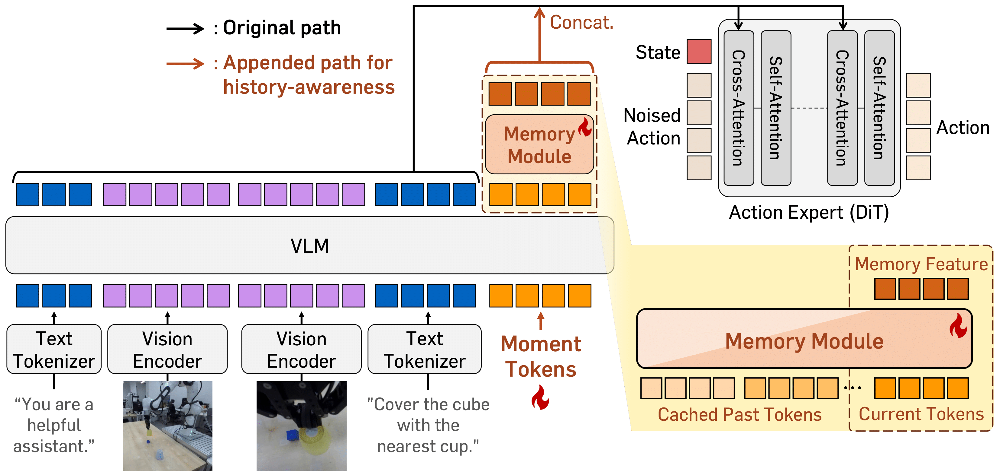

<div align="center">

# HAMLET on Isaac GR00T&nbsp;N1.6

### HAMLET: Switch your Vision-Language-Action Model into a History-Aware Policy
### ICLR 2026

[](https://arxiv.org/abs/2510.00695v3)
[](https://myungkyukoo.github.io/hamlet/)
[](https://github.com/myungkyuKoo/HAMLET-Isaac-GR00T-N1d6/tree/n1.5)

</div>

<p align="center">
  
</p>

> **This repository** is the official **HAMLET implementation on top of NVIDIA GR00T&nbsp;N1.6**, and evaluates on the **RoboMME** benchmark.<br>
> The GR00T&nbsp;**N1.5** version, which evaluates on **RoboCasa-Kitchen** benchmark, lives on the **[`n1.5` branch](https://github.com/myungkyuKoo/HAMLET-Isaac-GR00T-N1d6/tree/n1.5)** of this repo.<br>
> Paper: [arXiv:2510.00695](https://arxiv.org/abs/2510.00695v3) · Project page: [myungkyukoo.github.io/hamlet](https://myungkyukoo.github.io/hamlet/)

## 🧠 What is HAMLET?

Most Vision-Language-Action models (VLAs) are **Markovian**: they act from the *current* observation only and forget the past. **HAMLET** turns a pre-trained VLA into a **history-aware policy** with a small, efficient memory mechanism, without retraining the VLM backbone:

- **Moment tokens**: a few learnable query tokens are appended to the VLM input each step; their post-LLM hidden states summarize "what happened now."
- **Memory module**: a lightweight block-causal transformer aggregates the moment tokens over a window of past steps (oldest to current).
- **Action conditioning**: the memory-augmented summary is injected into the action head, so action prediction is conditioned on history.

This repo applies HAMLET to **GR00T&nbsp;N1.6** and evaluates on **RoboMME**, a benchmark of 16 memory-augmented manipulation tasks across four suites (Counting, Permanence, Reference, Imitation).

## ✨ This implementation

The HAMLET layer is exposed through a few CLI flags on top of the standard GR00T finetune entrypoint (`gr00t/experiment/launch_finetune.py`):

| Flag | Choices (default) | Meaning |
|---|---|---|
| `--hamlet-mode` | `off` \| `tcl` \| `finetune` (finetune) | enable HAMLET (Stage-2 fine-tune) or TCL pretraining; `off` is vanilla GR00T |
| `--n-moment-tokens` | int (4) | moment tokens per step (`n_q`) |
| `--memory-window` | int (4) | history length `K` (timestep blocks); raise it to condition on longer past context. The window spans ≈ `(K-1) × action_chunk` control steps (*e.g.,* `K=4` with a 16-step chunk ≈ 48 steps ≈ 4.8 s at 10 Hz) |
| `--memory-stride` | int (16) | environment steps between the `K` cached snapshots |
| `--memory-num-layers` | int (2) | depth of the memory transformer module |
| `--mem-cond-type` | `cross_attn` \| `adaln` (cross_attn) | how memory conditions the action head: concat into the cross-attention KV, **or** mean-pool into the DiT timestep embedding (AdaLN-zero) |
| `--memory-type` | `moment_token` \| `vision_feature` (moment_token) | what flows through the memory module: learnable **moment tokens** (paper), or the **primary-view image tokens** (post-LLM, pooled to 64/step) *(optional; not in the paper, but may help with low-level spatial memory)* |
| `--load-moment-tokens-from` | path (None) | warm-start `backbone.moment_tokens` from a Stage-1 (TCL) checkpoint dir or safetensors file |
| `--freeze-moment-tokens` / `--no-freeze-moment-tokens` | (script default: no-freeze) | whether to freeze the moment tokens during the Stage-2 fine-tune. **Freezing saves training cost** (the tokens stay at their TCL-pretrained values and leave the optimizer); **unfreezing (default) gives the best performance**, since the tokens keep adapting during fine-tuning. |

**Memory stride.** `--memory-stride` is the gap, in environment steps, between the `K` cached snapshots. Set it equal to the evaluation action-execution interval (`--n-action-steps`, default 16): the rolling memory cache advances once per policy call, so a matching stride keeps the training-time and inference-time history aligned.

**Memory attention mask.** The memory transformer module is **block-causal**: tokens *within* a timestep block attend bidirectionally, and blocks attend causally across time (a step sees its own and earlier steps, never the future).

**Moment-token initialization (TCL, optional).** Following the paper, the moment tokens can be warm-started with time-contrastive learning before the HAMLET fine-tune, then loaded (and optionally frozen) in Stage 2:

```bash
# Stage 1: TCL pretraining of the moment tokens (VLM frozen)
torchrun ... gr00t/experiment/launch_finetune.py ... \
    --hamlet-mode tcl --n-moment-tokens 4

# Stage 2: HAMLET fine-tune, warm-starting from the Stage-1 tokens
torchrun ... gr00t/experiment/launch_finetune.py ... \
    --hamlet-mode finetune \
    --load-moment-tokens-from <stage1-output>/checkpoint-<N> \
    --freeze-moment-tokens   # cost-saving option; omit for full performance

# Single-stage Training: You may skip TCL-initialization and randomly initialize moment tokens, so the moment tokens are trained end-to-end.
torchrun ... gr00t/experiment/launch_finetune.py ... \
    --hamlet-mode finetune \
    --n-moment-tokens 4 \
    --no-freeze-moment-tokens
```

**Freeze vs. unfreeze (Stage 2).** Freezing the moment tokens (`--freeze-moment-tokens`) lowers training cost so it is a reasonable choice when compute is tight. For **best performance, keep them unfrozen** (`--no-freeze-moment-tokens`, the default): letting the moment tokens keep adapting during the fine-tune consistently yields higher success. Treat freezing as a cost-saving option, not the setting for peak quality.

`--load-moment-tokens-from` accepts a checkpoint directory or a `model*.safetensors` file and copies **only** `backbone.moment_tokens` (everything else still initializes from `--base-model-path`). Without it, moment tokens are randomly initialized and trained end-to-end — the single-stage default in `run_scripts/train_hamlet_n1d6.sh` (opt into the two-stage recipe via the `LOAD_MOMENT_TOKENS_FROM` / `FREEZE_MOMENT_TOKENS=1` environment variables).


## ⚙️ Setup

```bash
# install this repo (uv; see NVIDIA Isaac-GR00T for full prerequisites)
uv sync && uv pip install -e .
source .venv/bin/activate
```

The base VLM is **`nvidia/GR00T-N1.6-3B`** (downloaded automatically by `--base-model-path` on first run).

All training / eval scripts read paths and knobs from **environment variables**, so they run unchanged on any machine (no paths are hard-coded).

## 📦 Dataset

We train on the official **[RoboMME](https://robomme.github.io/)** benchmark data, provided in LeRobot format on the Hugging Face Hub:

| Benchmark | Hugging Face dataset |
|---|---|
| RoboMME (16 tasks) | [`Yinpei/robomme_data_lerobot`](https://huggingface.co/datasets/Yinpei/robomme_data_lerobot) |

```bash
huggingface-cli download --repo-type dataset Yinpei/robomme_data_lerobot --local-dir data/robomme
```

**Dataset preparation (one-time, required).** The Hub release stores camera frames *inside* the parquet files (`image`-dtype features) and ships no `videos/` directory, no `meta/modality.json`, and no `meta/stats.json` — all three of which the GR00T loader requires. After downloading, run:

```bash
# 1) transcode the parquet-embedded frames into the videos/ layout the loader reads
python gr00t/data/make_videos.py --dataset-path data/robomme

# 2) install the GR00T modality mapping (state/action slices + camera-key renames)
cp gr00t/configs/data/robomme_modality.json data/robomme/meta/modality.json

# 3) generate normalization stats (demo frames are excluded from relative-action stats)
python gr00t/data/stats.py --dataset-path data/robomme --embodiment-tag NEW_EMBODIMENT \
    --modality-config-path gr00t/configs/data/robomme_config.py
```

**Demonstration frames.** RoboMME episodes include demonstration (watch-phase) frames. They are automatically excluded from the action loss while still populating the memory window, and at evaluation the demo frames are replayed through the policy to prime the memory before the first action.

## 🏋️ Training

Two scripts cover everything; all options are environment variables (see the config block at the top of each script). Training uses `torchrun` over `NUM_GPUS` (default 4).

```bash
# vanilla GR00T N1.6 baseline
DATASET_PATH=data/robomme bash run_scripts/train_vanilla_n1d6.sh

# GR00T N1.6 + HAMLET
DATASET_PATH=data/robomme bash run_scripts/train_hamlet_n1d6.sh
```

HAMLET options (env vars on `train_hamlet_n1d6.sh`): `K` (memory window), `MEMORY_STRIDE`, `MEM_COND_TYPE` (`cross_attn` | `adaln`), `MEMORY_TYPE` (`moment_token` | `vision_feature`). Examples:

```bash
MEM_COND_TYPE=adaln            DATASET_PATH=data/robomme bash run_scripts/train_hamlet_n1d6.sh
K=8 MEMORY_TYPE=vision_feature DATASET_PATH=data/robomme bash run_scripts/train_hamlet_n1d6.sh
```

**Compute.** On 4× GPUs (global batch 32, 60k steps), our RoboMME runs took ≈ 6 h for vanilla N1.6 and ≈ 11 h for N1.6 + HAMLET (K=4).

## 🧪 Evaluation

Evaluation uses a **policy-server / rollout-client** split: this repo serves the trained GR00T policy over a local socket (`gr00t/eval/run_gr00t_server.py`), and the RoboMME rollout client drives the simulator and queries the server. The rollout client is **included in this repo** (`gr00t/eval/sim/robomme/run_robomme_rollout.py`); only the **simulator** is external.

**1) Install the RoboMME benchmark (separate environment).** Follow the official instructions at [robomme.github.io](https://robomme.github.io/) (clone [`RoboMME/robomme_benchmark`](https://github.com/RoboMME/robomme_benchmark), then `uv sync && uv pip install -e .` inside it); it provides the `robomme` package (env + `BenchmarkEnvBuilder`). Set `ROBOMME_PYTHON` to that venv's python. The rollout client runs in that environment (with this repo on `PYTHONPATH`, handled by the script), so it also needs this repo's client-side deps (`msgpack`/`pyzmq` for the ZMQ policy client, `pandas` for `simulation_results.csv`), which a default benchmark sync does not install:

```bash
# inside the robomme_benchmark checkout
uv pip install -r ./run_scripts/robomme_client_requirements.txt
```

`uv sync` prunes packages that are not in the benchmark's lockfile — re-run this install after any `uv sync` there.

**2) Run eval** (orchestrates server + client over all 16 tasks):

```bash
MODEL_PATH=runs/robomme/hamlet_n1d6/checkpoint-60000 \
ROBOMME_PYTHON=/path/to/robomme_benchmark/venv/bin/python \
bash run_scripts/eval_n1d6.sh
```

`OUTPUT_DIR` defaults to `runs/eval/robomme/<run>-<checkpoint>` (here `runs/eval/robomme/hamlet_n1d6-checkpoint-60000`), and each per-task output directory is bound to its checkpoint and eval settings via a `policy_manifest.json`: resuming into results from a different checkpoint fails instead of silently reusing them. `ONLY_TASKS=BinFill,PatternLock` restricts to a subset; `GR00T_INFERENCE_SEED` fixes the flow-matching noise for deterministic eval. Each task waits for its policy server to come up (`SERVER_TIMEOUT`, default 300 s); a task fails when the server never becomes ready, the rollout client exits non-zero, or no `simulation_results.csv` appears, and the script then exits non-zero listing the failed tasks.

**3) Aggregate** per-task results into suite + overall success rates:

```bash
python gr00t/eval/sim/robomme/aggregate_eval_summary.py runs/eval/robomme/hamlet_n1d6-checkpoint-60000
```

## 📁 Repository layout

```
gr00t/                          core GR00T package + HAMLET additions
  model/modules/memory.py       HAMLET memory transformer (block-causal) module
  model/modules/eagle_backbone.py  moment-token injection, primary-view feature
  model/gr00t_n1d6/             model wiring: memory paths, AdaLN-zero pool
  model/gr00t_n1d6/tcl_head.py  Stage-1 TCL head
  configs/data/robomme_config.py   RoboMME modality config
  eval/run_gr00t_server.py      policy server for evaluation
  eval/sim/robomme/             RoboMME rollout client + result aggregation
  policy/server_client.py       ZMQ policy client used by the rollout client
run_scripts/                    runnable bash launchers
  train_vanilla_n1d6.sh         vanilla GR00T N1.6 training
  train_hamlet_n1d6.sh          GR00T N1.6 + HAMLET training (all options via env vars)
  eval_n1d6.sh                  eval orchestration (server + rollout client)
```

## 📝 Notes

- All paths/knobs are environment variables; nothing is machine-specific.
- Checkpoints, rollouts (`*.mp4`), logs, and datasets are git-ignored.
- The rollout client is included; only the RoboMME simulator package is external. See Evaluation.

## 🙏 Acknowledgements

Built on **[NVIDIA Isaac-GR00T](https://github.com/NVIDIA/Isaac-GR00T)** (`n1.6.1-release` tag). The base model, license, and core VLA stack are NVIDIA's; HAMLET adds the memory module and its training/evaluation. Evaluation uses the **[RoboMME](https://robomme.github.io/)** benchmark. See [`LICENSE`](LICENSE).

## 📚 Citation

```bibtex
@inproceedings{koo2026hamlet,
  title={{HAMLET}: Switch Your Vision-Language-Action Model into a History-Aware Policy},
  author={Myungkyu Koo and Daewon Choi and Taeyoung Kim and Kyungmin Lee and Changyeon Kim and Younggyo Seo and Jinwoo Shin},
  booktitle={The Fourteenth International Conference on Learning Representations},
  year={2026},
  url={https://openreview.net/forum?id=KcJ9U0x6kO}
}